# Secure Multi-Tier Auto-Scaling Infrastructure on AWS

> A production-grade, defence-in-depth 3-tier cloud architecture built entirely with Terraform.
> Demonstrates advanced AWS security engineering across networking, compute hardening,
> identity, auditing, threat response, and operational observability.


---

## Table of Contents

- [About This Project](#about-this-project)
- [Architecture](#architecture)
- [Architecture Decisions and Rationale](#architecture-decisions-and-rationale)
- [Security Controls Implemented](#security-controls-implemented)
- [Project Structure](#project-structure)
- [Prerequisites](#prerequisites)
- [Quick Start](#quick-start)
- [Module Documentation](#module-documentation)
- [Compliance Alignment](#compliance-alignment)
- [Deployed Infrastructure — Live Resource IDs](#deployed-infrastructure--live-resource-ids)
- [Terminal Evidence](#Terminal-Evidence)
- [AWS Console Evidence](#-aws-console-evidence)
- [Destroy Infrastructure](#destroy-infrastructure)
- [Enabling GuardDuty and Security Hub](#enabling-guardduty-and-security-hub)
- [Contributing](#contributing)
- [Author](#author)
- [License](#license)

---

## About This Project

This project provisions a fully hardened, production-grade 3-tier AWS infrastructure
from scratch using Terraform. Every security decision is intentional and documented.

**What makes this different from a typical cloud project:**

- Zero SSH keys anywhere in the architecture. Access is exclusively through
  AWS Systems Manager Session Manager — authenticated by IAM, logged by CloudTrail.
- Every EC2 instance enforces IMDSv2, blocking an entire class of SSRF credential
  theft attacks at the hypervisor level.
- Security Groups are chained — each tier only trusts the security group of the
  tier directly above it, never a CIDR range. This limits blast radius from
  lateral movement.
- Network ACLs provide a second, stateless layer of packet filtering independent
  of Security Groups — true defence-in-depth.
- The database subnet has no internet route at all. Not a NAT route. No route.
- Every API call, every login, every resource change is captured in CloudTrail
  with log file validation enabled to detect tampering.
- VPC Flow Logs record every network packet for forensic analysis.
- Four CloudWatch alarms provide real-time operational monitoring with SNS email alerts.

**Technologies used:**
Terraform, Amazon VPC, Security Groups, Network ACLs, AWS SSM Session Manager,
AWS CloudTrail, VPC Flow Logs, CloudWatch Alarms, SNS, Application Load Balancer,
Auto Scaling Groups, IAM, EBS Encryption, IMDSv2, VPC Interface Endpoints.

---

## Architecture


## Architecture Decisions and Rationale

### Why three separate subnet tiers?

Separating workloads into public, private, and database subnets enforces the
principle of least privilege at the network level. The ALB needs a public IP
to serve internet traffic — so it lives in the public subnet. App servers need
to respond to the ALB but never need inbound internet access — so they live in
the private subnet behind a NAT Gateway. The database has no reason to ever
initiate or receive internet connections — so it lives in the database subnet
with a route table that contains no internet route at all.

### Why Security Group Chaining instead of CIDR rules?

A CIDR rule such as `allow 10.0.1.0/24 → 10.0.10.0/24` grants access to any
resource currently or future deployed in that subnet. If an attacker compromises
one instance and moves laterally to another in the same subnet, they inherit the
same access. Security group chaining (`source = alb_sg_id`) grants access only
to resources explicitly assigned that security group — not to a subnet. This
limits blast radius precisely.

### Why NACLs in addition to Security Groups?

Security Groups are stateful — they remember connections and automatically allow
return traffic. NACLs are stateless — they evaluate every packet independently,
including return packets. Using both creates two independent layers. An attacker
who somehow bypasses a misconfigured Security Group still hits the NACL. The
controls are implemented by different AWS subsystems, so a bug or misconfiguration
in one does not affect the other.

### Why SSM Session Manager instead of SSH?

SSH requires: an open port 22, a key pair file, key rotation management, and
produces logs only if you configure a bastion host. SSM Session Manager requires:
an IAM role on the EC2 instance and the SSM agent. Access is authenticated by
AWS IAM (MFA-enforced, federated, auditable), every session is logged in
CloudTrail with the caller identity, and port 22 is never opened. There is no
key pair to lose, rotate, or have stolen.

### Why VPC Interface Endpoints?

Without VPC endpoints, SSM traffic from private EC2 instances travels:
instance → NAT Gateway → public internet → AWS SSM service. This exposes SSM
traffic to the public internet and incurs NAT Gateway data charges. With VPC
endpoints, traffic travels entirely within the AWS backbone and never leaves the
VPC. This is smaller attack surface, lower latency, and lower cost.

### Why IMDSv2?

The EC2 Instance Metadata Service (IMDS) at `http://169.254.169.254/` returns
IAM credentials, instance identity, and configuration. In IMDSv1, any HTTP GET
could read this — making any Server-Side Request Forgery (SSRF) vulnerability in
a web application directly exploitable to steal AWS credentials. IMDSv2 requires
a session-oriented PUT request with a time-limited token before any metadata is
returned. SSRF attacks typically cannot issue PUT requests, blocking this attack
path entirely. Setting `http_tokens = required` enforces this at the hypervisor
level regardless of application code.

---

## Security Controls Implemented

| # | Control | Layer | Implementation | What It Prevents |
|---|---------|-------|----------------|-----------------|
| 1 | 3-Tier Network Segmentation | Network | VPC Subnets | Lateral movement, direct DB exposure |
| 2 | Network ACLs | Network | Stateless subnet firewall | Second-layer packet filtering |
| 3 | Security Group Chaining | Network | SG-to-SG rules only | Subnet-wide lateral movement |
| 4 | No Public IPs on App/DB | Network | Launch Template config | Direct internet exposure |
| 5 | NAT Gateway | Network | Private subnet routing | Inbound internet to private tier |
| 6 | VPC Flow Logs | Network | CloudWatch Logs | Blind spots in network forensics |
| 7 | VPC Interface Endpoints | Network | SSM/Logs endpoints | SSM traffic on public internet |
| 8 | Database RT Isolation | Network | Empty route table | Any internet path to DB tier |
| 9 | IMDSv2 Required | Compute | http_tokens = required | SSRF credential theft |
| 10 | EBS Encryption | Compute | encrypted = true | Data exposed via disk theft |
| 11 | No SSH Key Pairs | Compute | No key_name in LT | Stolen key access |
| 12 | IAM Instance Profile | Identity | SSM + CW policies | Hardcoded credentials |
| 13 | Least Privilege IAM | Identity | Scoped policies | Over-privileged EC2 access |
| 14 | SSM Session Manager | Access | VPC Endpoints + IAM | Port 22 exposure |
| 15 | CloudTrail Multi-Region | Audit | All API logging | Undetected API activity |
| 16 | CloudTrail Validation | Audit | Log file validation | Tampered audit logs |
| 17 | CloudTrail S3 Encryption | Audit | AES-256 S3 SSE | Exposed audit logs |
| 18 | CloudWatch Alarms | Monitoring | CPU, errors, health | Undetected incidents |
| 19 | SNS Alerting | Monitoring | Email subscriptions | Silent failures |

---

## Project Structure
```bash
secure-multi-tier-infra/
│
├── providers.tf               # AWS provider config + Terraform version constraint
├── main.tf                    # Root module — orchestrates all child modules
├── variables.tf               # All input variable definitions with descriptions
├── outputs.tf                 # Key resource identifiers exposed after apply
├── terraform.tfvars           # Your environment-specific variable values
├── .gitignore                 # Excludes state files, lock files, credentials
├── README.md                  # This file
│
├── screenshots/               # Evidence screenshots for portfolio
│   ├── 01-terraform-apply-complete.png
│   ├── 02-vpc-overview.png
│   ├── 03-six-subnets.png
│   ├── 04-public-route-table.png
│   ├── 05-private-route-table.png
│   ├── 06-database-route-table.png
│   ├── 07-three-nacls.png
│   ├── 08-nacl-database-rules.png
│   ├── 09-sg-chaining-app.png
│   ├── 10-sg-chaining-db.png
│   ├── 11-asg-details.png
│   ├── 12-asg-instances-inservice.png
│   ├── 13-alb-live-webpage.png
│   ├── 14-ssm-fleet-manager-online.png
│   ├── 15-ssm-session-terminal.png
│   ├── 16-cloudwatch-four-alarms.png
│   ├── 17-cloudtrail-trail.png
│   ├── 18-vpc-flow-logs-streams.png
│   ├── 19-imdsv2-enforced.png
│   └── 20-ebs-volume-encrypted.png
│
└── modules/
├── vpc/                   # VPC, 6 subnets, IGW, NAT, 3 route tables, flow logs
│   ├── main.tf
│   ├── variables.tf
│   └── outputs.tf
├── security_groups/       # ALB, App, DB, Endpoint SGs with chaining
│   ├── main.tf
│   ├── variables.tf
│   └── outputs.tf
├── nacl/                  # Public, Private, Database NACLs
│   ├── main.tf
│   ├── variables.tf
│   └── outputs.tf
├── iam/                   # EC2 IAM role + instance profile for SSM
│   ├── main.tf
│   ├── variables.tf
│   └── outputs.tf
├── endpoints/             # VPC Interface Endpoints for SSM private access
│   ├── main.tf
│   ├── variables.tf
│   └── outputs.tf
├── alb/                   # Application Load Balancer, Target Group, Listener
│   ├── main.tf
│   ├── variables.tf
│   └── outputs.tf
├── compute/               # Launch Template + Auto Scaling Group + scaling policy
│   ├── main.tf
│   ├── variables.tf
│   └── outputs.tf
├── guardduty/             # GuardDuty stub (requires account subscription)
│   ├── main.tf
│   ├── variables.tf
│   └── outputs.tf
└── monitoring/            # CloudWatch Alarms, CloudTrail, S3 audit bucket, SNS
├── main.tf
├── variables.tf
└── outputs.tf
```
----
## Prerequisites

| Tool | Minimum Version | Installation |
|------|----------------|--------------|
| Terraform | 1.5.0 | `brew install hashicorp/tap/terraform` |
| AWS CLI | 2.0 | `brew install awscli` |
| GitHub CLI | 2.0 | `brew install gh` |
| AWS Account | — | IAM user with AdministratorAccess |

**Verify all tools are installed:**
```bash
terraform version
aws --version
gh --version
aws sts get-caller-identity
```

---

## Quick Start

```bash
# 1. Clone the repository
git clone https://github.com/YOUR_USERNAME/secure-multi-tier-infra.git
cd secure-multi-tier-infra

# 2. Set your alert email
nano terraform.tfvars
# Change: alert_email = "your-real-email@example.com"

# 3. Configure AWS credentials
aws configure

# 4. Initialise Terraform (downloads providers)
terraform init

# 5. Validate all configuration
terraform validate

# 6. Preview all resources to be created
terraform plan -out=tfplan

# 7. Deploy (~10 minutes)
terraform apply tfplan

# 8. Get your outputs
terraform output
```

**Cost estimate: $8–15 per day.** Always destroy when done testing.

---

## Module Documentation

### `modules/vpc`
Creates the foundational network: one VPC, six subnets across two availability
zones (2 public, 2 private, 2 database), an Internet Gateway, a NAT Gateway with
Elastic IP, three route tables with correct routing per tier, and VPC Flow Logs
delivered to CloudWatch.

Key outputs: `vpc_id`, `public_subnet_ids`, `private_subnet_ids`,
`database_subnet_ids`, `flow_log_group_name`

### `modules/security_groups`
Creates four security groups with chaining enforced. The ALB SG accepts port 80/443
from the internet. The App SG accepts port 80 only from the ALB SG (not from a
CIDR). The DB SG accepts port 3306 only from the App SG. The Endpoint SG accepts
port 443 from the App SG for SSM communication.

Key outputs: `alb_sg_id`, `app_sg_id`, `database_sg_id`, `endpoint_sg_id`

### `modules/nacl`
Creates three Network ACLs, one per subnet tier, and associates each with its
subnets. The public NACL allows HTTP, HTTPS, and ephemeral ports. The private
NACL allows HTTP from public CIDRs, HTTPS for SSM, and ephemeral ports. The
database NACL allows only MySQL from private CIDRs.

### `modules/iam`
Creates an IAM role with three policies: `AmazonSSMManagedInstanceCore` (enables
Session Manager), `CloudWatchAgentServerPolicy` (enables metrics and logs), and an
inline policy for SSM session logging. Wraps the role in an instance profile for
EC2 attachment.

### `modules/endpoints`
Creates five VPC Interface Endpoints: ssm, ssmmessages, ec2messages, logs, and
monitoring. All attached to private subnets with private DNS enabled. This keeps
all SSM and CloudWatch traffic inside the AWS backbone, away from the public internet.

### `modules/alb`
Creates an internet-facing Application Load Balancer in public subnets, a target
group with HTTP health checks on `/`, and an HTTP listener that forwards to the
target group.

### `modules/compute`
Uses a `data` source to automatically fetch the latest Amazon Linux 2 AMI — no
hardcoded AMI IDs. Creates a Launch Template with IMDSv2 enforced, EBS encryption
enabled, no key pair, no public IP, and a bootstrap script that installs Apache and
displays a status page. Creates an Auto Scaling Group with target tracking scaling
policy at 50% CPU.

### `modules/monitoring`
Creates four CloudWatch alarms (high CPU, low CPU, ALB 5XX errors, unhealthy hosts)
all connected to an SNS topic with email subscription. Creates a CloudTrail trail
with multi-region logging, log file validation, and an encrypted, versioned,
private S3 bucket.

---

## Compliance Alignment

| Control Domain | Implementation | Standard Reference |
|---------------|----------------|-------------------|
| Network segmentation | 3-tier VPC with isolated route tables | CIS AWS 4.x, NIST 800-53 SC-7 |
| Encryption at rest | EBS volumes encrypted AES-256 | CIS AWS 2.2.1, SOC2 CC6.7 |
| Audit logging | CloudTrail multi-region, validated | CIS AWS 3.x, SOC2 CC7.2 |
| Network monitoring | VPC Flow Logs to CloudWatch | CIS AWS 2.9, NIST 800-53 AU-12 |
| Access control | IAM roles, no long-lived keys | CIS AWS 1.x, SOC2 CC6.1 |
| Keyless access | SSM Session Manager, IAM-authenticated | NIST 800-53 AC-17 |
| Instance hardening | IMDSv2 required | CIS AWS 5.6 |
| Least privilege | Scoped IAM policies per service | CIS AWS 1.16 |

---

## Deployed Infrastructure — Live Resource IDs

After running `terraform output` you will see your actual resource IDs.
Example output from this deployment:
alb_dns_name = "secure-infra-alb-1084472511.us-east-1.elb.amazonaws.com" asg_name = "secure-infra-asg" cloudtrail_s3_bucket = "secure-infra-cloudtrail-957014951663" database_subnet_ids = ["subnet-0c496f89741b66336", "subnet-010854f175574d0e7"] flow_log_group = "/aws/vpc/flowlogs/secure-infra" private_subnet_ids = ["subnet-02965238d42bd719f", "subnet-06f9256dbbc924e26"] public_subnet_ids = ["subnet-005d12e975e7be154", "subnet-049814faf20d44720"] vpc_id = "vpc-02264825338001222"

---

## Terminal Evidence

### 01 — Terraform Apply Complete
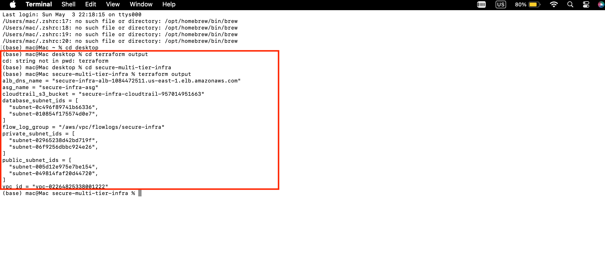

*All resources created. Outputs confirm VPC, ALB, ASG, CloudTrail, and subnet IDs.*

---

## AWS Console Evidence

### 02 — VPC Overview
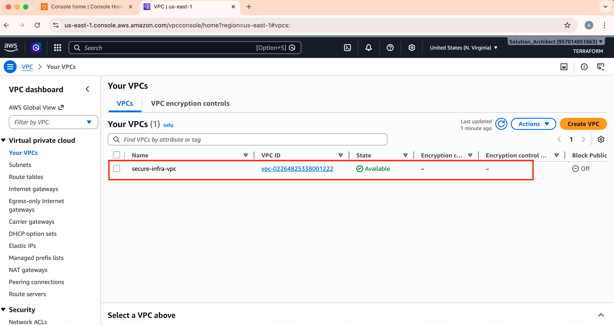

*VPC `secure-infra-vpc` with CIDR 10.0.0.0/16. DNS hostnames and resolution enabled.*

---

### 03 — Six Subnets Across Three Tiers
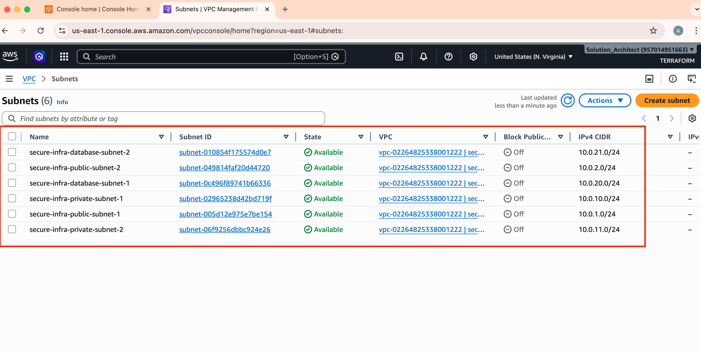

*Two public (10.0.1.x, 10.0.2.x), two private (10.0.10.x, 10.0.11.x), two database (10.0.20.x, 10.0.21.x) subnets — each in a separate availability zone.*

---

### 04 — Public Route Table
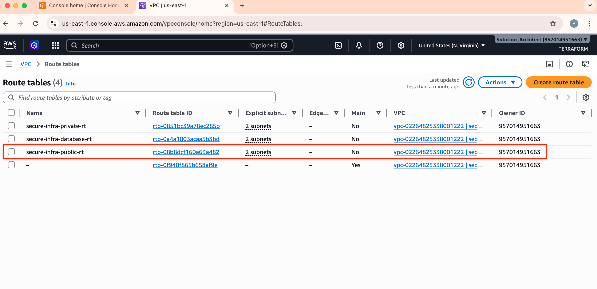

*Route 0.0.0.0/0 → Internet Gateway. The ALB can reach the internet from public subnets.*

---

### 05 — Private Route Table
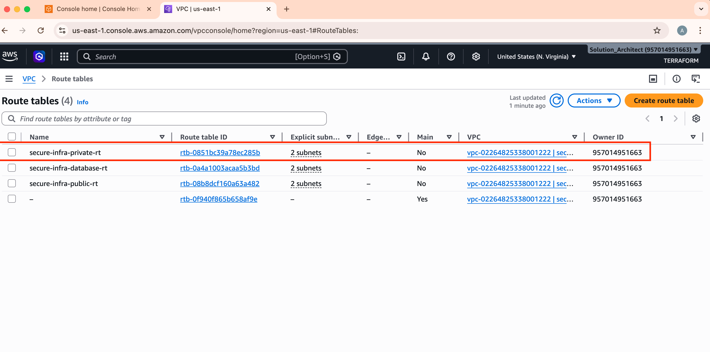

*Route 0.0.0.0/0 → NAT Gateway. App servers can reach the internet outbound only (for updates, SSM). No inbound path from internet.*

---

### 06 — Database Route Table
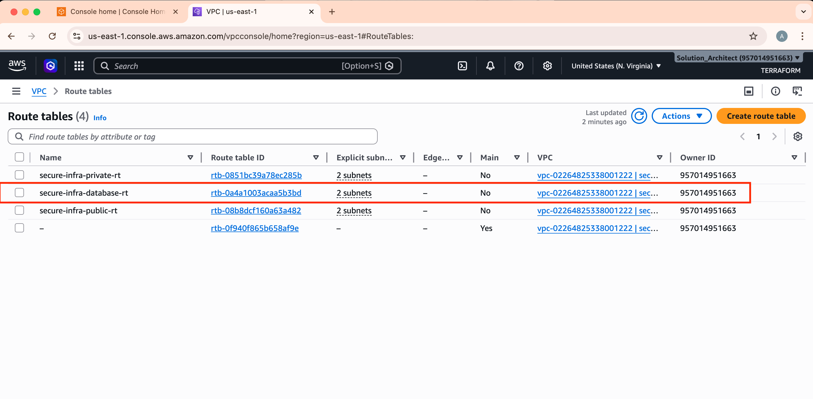

*Only local VPC route (10.0.0.0/16 → local). Zero internet path exists to or from the database tier.*

---

### 07 — Three Network ACLs
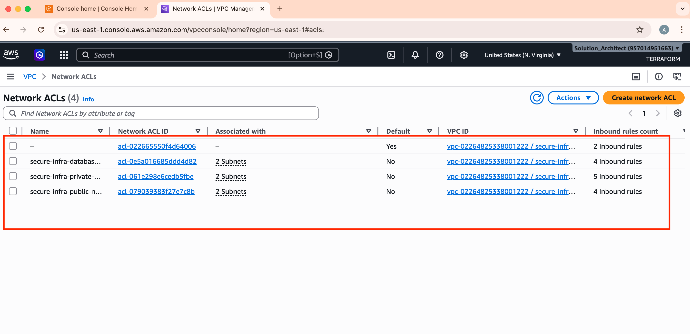

*Separate stateless NACLs for each tier. Each NACL is associated only with its tier's subnets.*

---

### 08 — Database NACL Rules
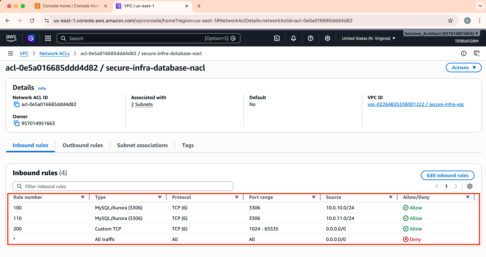

*Database NACL allows only MySQL (3306) inbound from private subnet CIDRs. No 0.0.0.0/0 rule exists.*

---

### 09 — Security Group Chaining — App SG
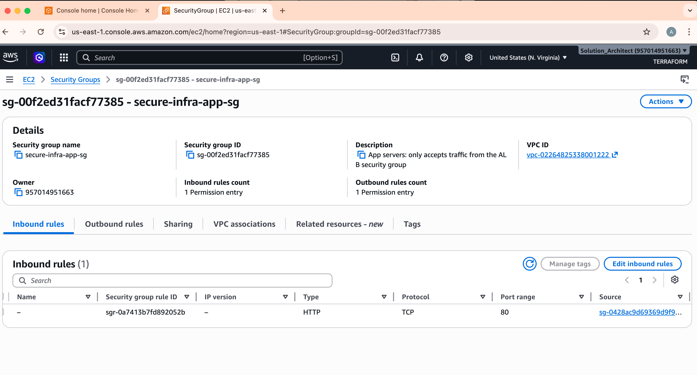

*App SG inbound rule source is `sg-xxxxx (secure-infra-alb-sg)` — a Security Group reference, not a CIDR. This is security group chaining.*

---

### 10 — Security Group Chaining — DB SG
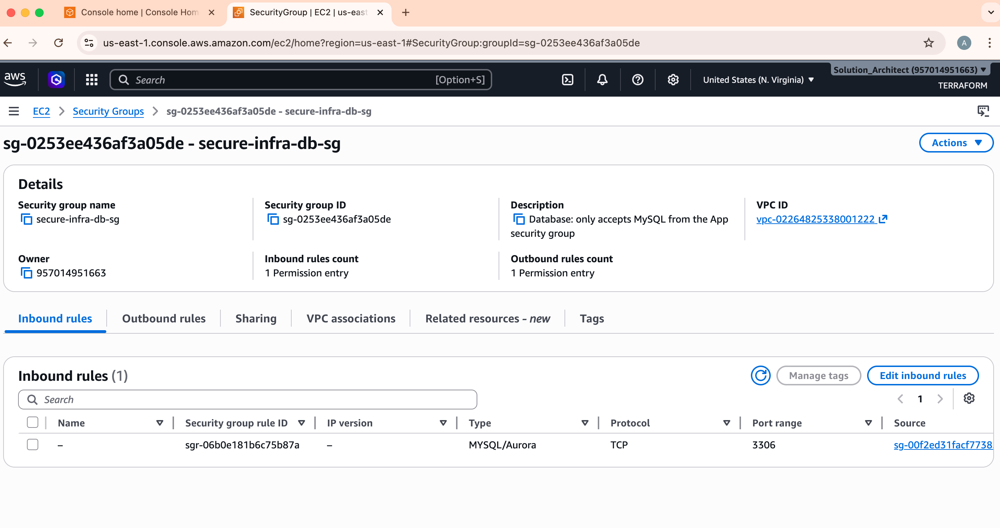

*DB SG inbound rule source is `sg-xxxxx (secure-infra-app-sg)`. The chain continues: only the app tier can reach the database.*

---

### 11 — Auto Scaling Group Details
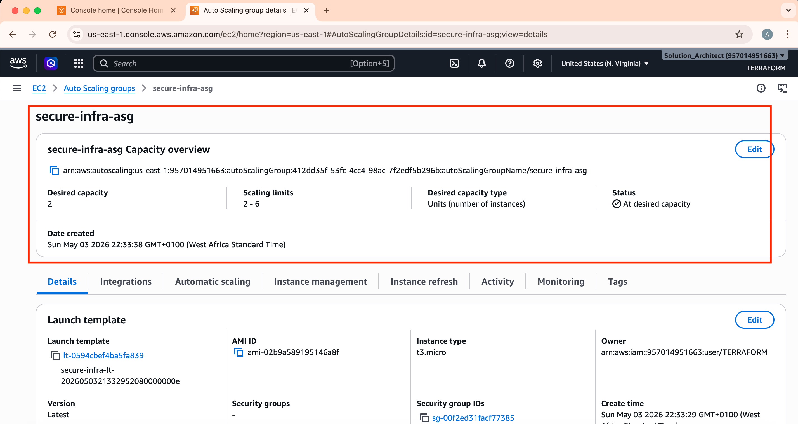

*ASG configured: Min=2, Max=6, Desired=2. Health check type=ELB. Deployed across two private subnets in different AZs.*

---

### 12 — Two Instances InService
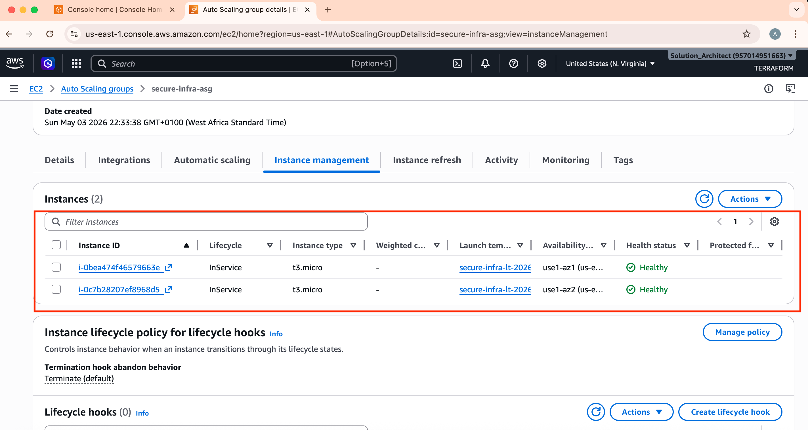

*Both instances show Lifecycle=InService, Health=Healthy. Auto Scaling is working and ELB health checks are passing.*

---

### 13 — Live Application via ALB
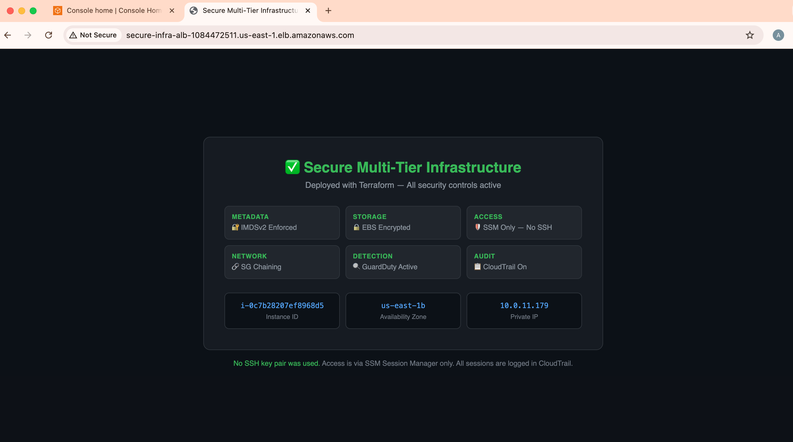

*App is live at the ALB DNS URL. Page shows Instance ID, AZ, Private IP, and all 6 active security controls. Proves: Internet → ALB (public subnet) → EC2 (private subnet) chain works end-to-end.*

---

### 14 — SSM Fleet Manager — Instances Online
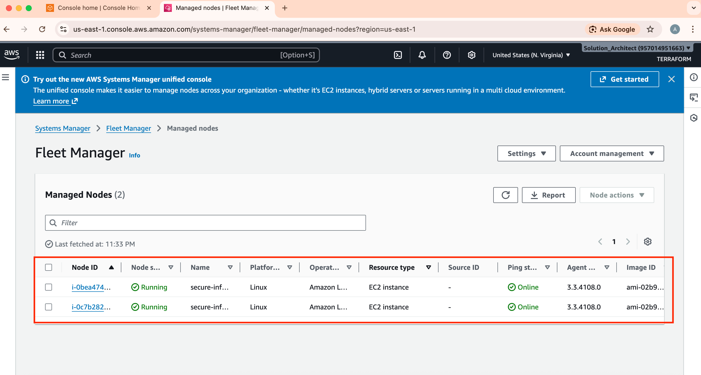

*Both instances show SSM Agent ping status = Online. No SSH key pair is configured. Management is entirely through AWS SSM.*

---

### 15 — SSM Session Terminal — Keyless Access
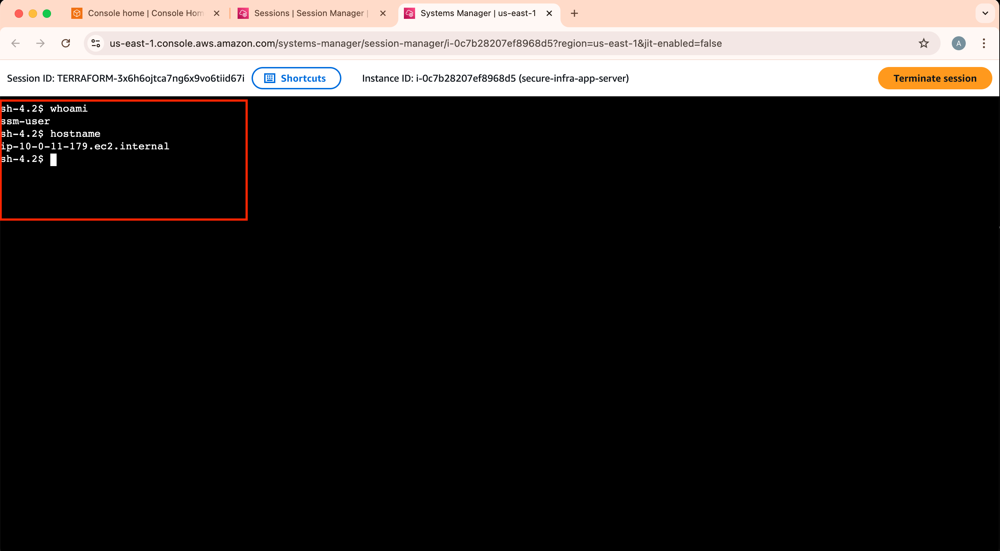

*Browser-based terminal session started through Session Manager. No port 22. No key pair. Session is authenticated by IAM and logged in CloudTrail.*

---

### 16 — Four CloudWatch Alarms — All Green
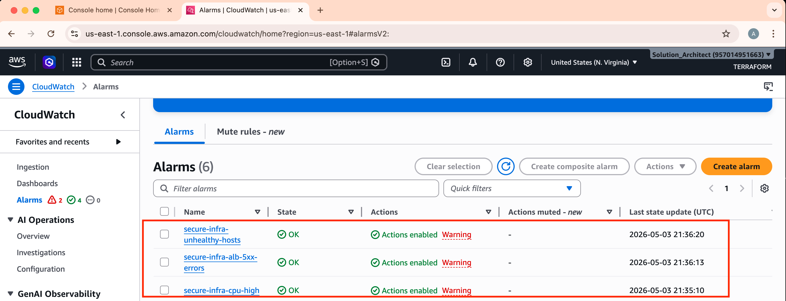

*All four alarms in OK state: cpu-high, cpu-low, alb-5xx-errors, unhealthy-hosts. SNS email subscription active for all.*

---

### 17 — CloudTrail Trail Active
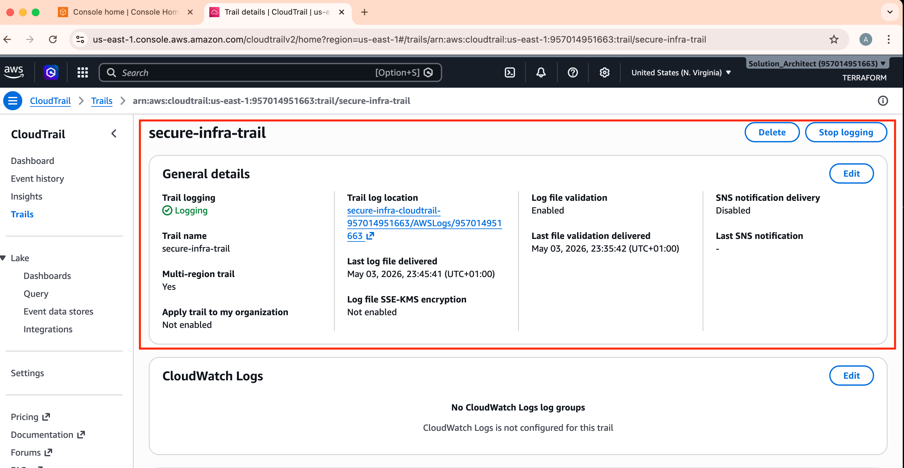

*Trail `secure-infra-trail`: Multi-region=Yes, Log file validation=Enabled. Every AWS API call is recorded and tamper-evident.*

---

### 18 — VPC Flow Logs Streaming
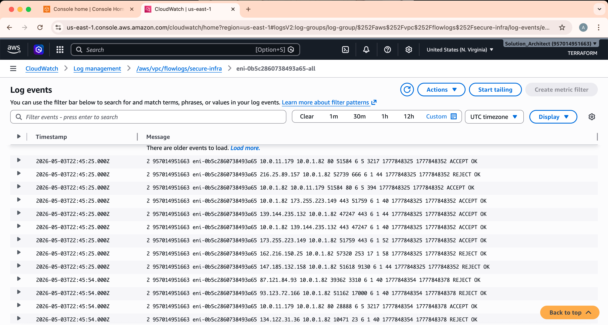

*Log group `/aws/vpc/flowlogs/secure-infra` with active log streams. Every accepted and rejected network packet is recorded.*

---

### 19 — IMDSv2 Enforced
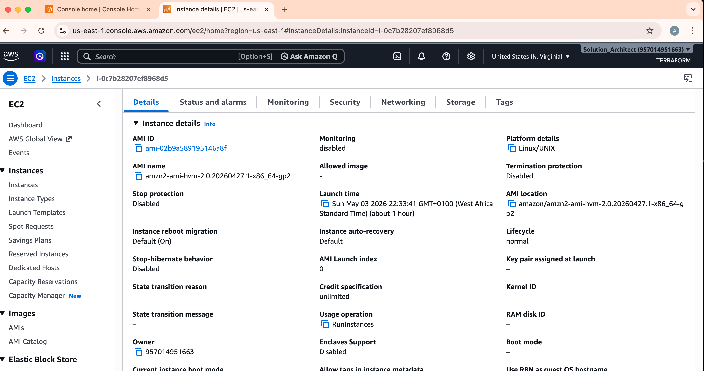

*Instance Advanced Details: Metadata version = V2 only (token required). SSRF attacks cannot steal IAM credentials via the metadata service.*

---

### 20 — EBS Volumes Encrypted
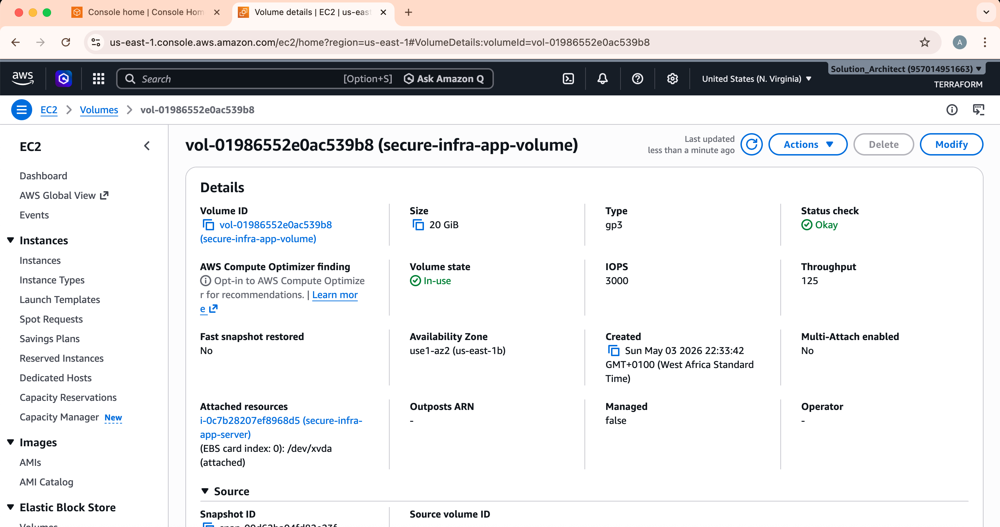

*EC2 volumes show Encrypted=Yes. All data written to disk is AES-256 encrypted at the hypervisor level.*

---

## Destroy Infrastructure

```bash
terraform destroy -auto-approve
```

This removes all resources and stops all charges. Takes approximately 8 minutes.

---

## Enabling GuardDuty and Security Hub

GuardDuty requires an AWS account with the GuardDuty service subscription enabled.
This is available on standard AWS accounts but not on all restricted or
organisation-managed accounts.

To enable GuardDuty on a supported account, replace
`modules/guardduty/main.tf` with the full implementation:

```hcl
resource "aws_guardduty_detector" "main" {
  enable = true
  tags   = { Name = "${var.project_name}-guardduty" }
}
```

Then add the module back to `main.tf`:

```hcl
module "guardduty" {
  source       = "./modules/guardduty"
  project_name = var.project_name
  alert_email  = var.alert_email
}
```

And run:
```bash
terraform plan -out=tfplan
terraform apply tfplan
```

---

## Contributing

1. Fork the repository
2. Create a feature branch: `git checkout -b feature/your-feature-name`
3. Commit your changes: `git commit -m "feat: description of change"`
4. Push to the branch: `git push origin feature/your-feature-name`
5. Open a Pull Request

---
# Author
**Adeoye Emmanuel** - AWS Certified Solutions Architect | AWS Security Solutions Architect | DevSecOps Engineer

**Email:** Emmanuelofgrace@gmail.com

 LinkedIn: www.linkedin.com/in/emmanuel-adeoye-29187bb7

 -------

# License
This project is licensed under the MIT License
```bash

MIT License

Copyright (c) 2025 [Adeoye Emmanuel Eniola]

Permission is hereby granted, free of charge, to any person obtaining a copy
of this software and associated documentation files (the "Software"), to deal
in the Software without restriction, including, without limitation, the rights
to use, copy, modify, merge, publish, distribute, sublicense, and/or sell
copies of the Software, and to permit persons to whom the Software is
furnished to do so, subject to the following conditions:

The above copyright notice and this permission notice shall be included in all
copies or substantial portions of the Software.

THE SOFTWARE IS PROVIDED "AS IS", WITHOUT WARRANTY OF ANY KIND, EXPRESS OR
IMPLIED, INCLUDING BUT NOT LIMITED TO THE WARRANTIES OF MERCHANTABILITY,
FITNESS FOR A PARTICULAR PURPOSE AND NONINFRINGEMENT. IN NO EVENT SHALL THE
AUTHORS OR COPYRIGHT HOLDERS BE LIABLE FOR ANY CLAIM, DAMAGES OR OTHER
LIABILITY, WHETHER IN AN ACTION OF CONTRACT, TORT OR OTHERWISE, ARISING FROM,
OUT OF OR IN CONNECTION WITH THE SOFTWARE OR THE USE OR OTHER DEALINGS IN THE
SOFTWARE.
```

